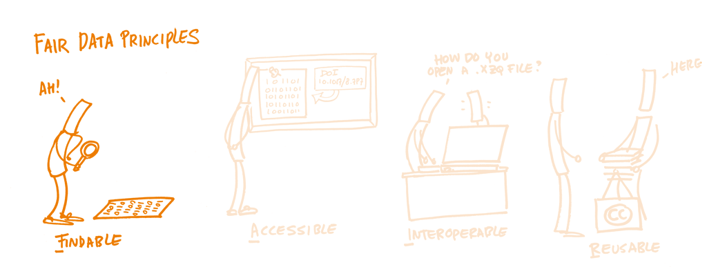
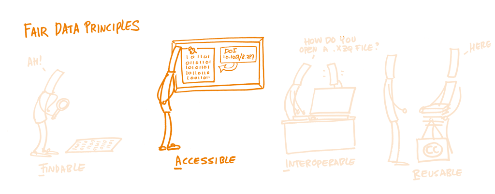
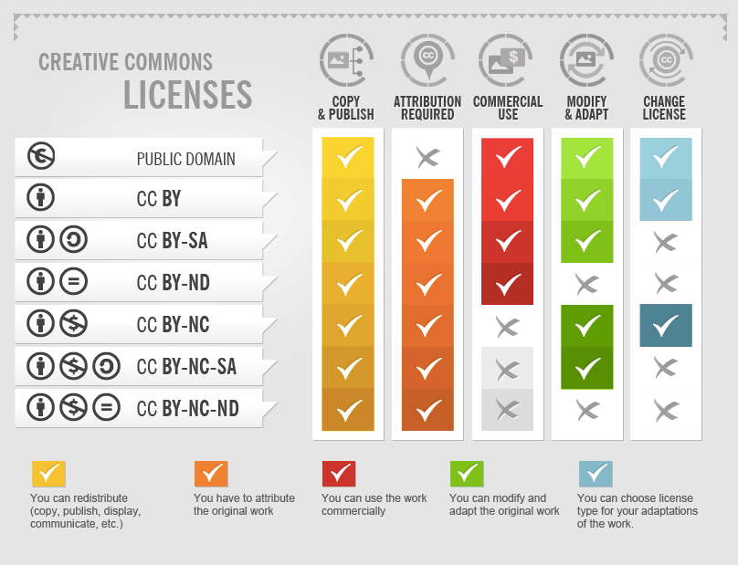
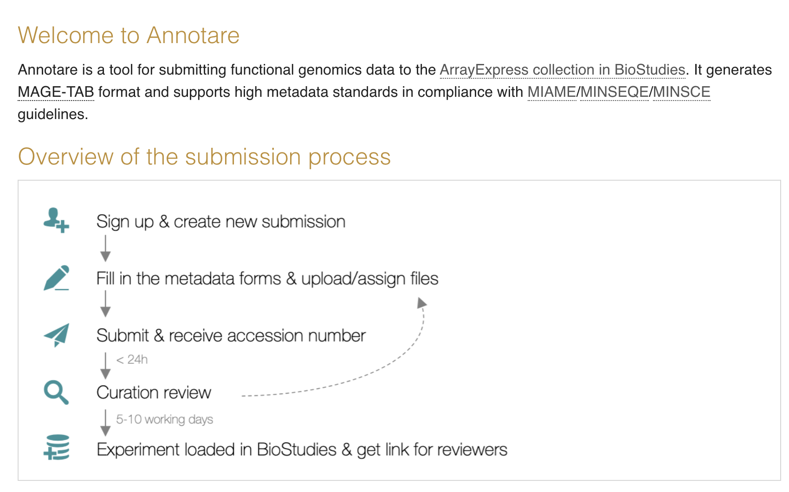

---
title: Introduction to Open Science and FAIR principles
summary: In this lesson we provide a short intro to what is Open Science and FAIR principles
---

# Introduction to Open Science and FAIR principles

**Last updated:** *{{ git_revision_date_localized }}*

!!! note "Section Overview"

    &#128368; **Time Estimation:** X minutes  

    &#128172; **Learning Objectives:** 

    1. Learn about Open Science
    2. Learn about FAIR principles
    3. Learn about how they can be applied to NGS data  
  
Open Science and FAIR principles have emerged as powerful frameworks that promote transparency, accessibility, and reusability in scientific research. As the landscape of scientific knowledge sharing evolves, these principles stand at the front of a global movement to accelerate scientific discovery and innovation. Open Science advocates for the unrestricted access to research outputs, data, and methodologies, fostering collaboration and opening scientific knowledge. On the other hand, the FAIR principles emphasize the importance of making data Findable, Accessible, Interoperable, and Reusable, laying the foundation for a data-driven approach that transcends disciplinary boundaries and supports long-term data preservation. Together, Open Science and FAIR principles offer a vision for a more inclusive and impactful scientific ecosystem that advances the boundaries of knowledge for the benefit of society as a whole. Funding agencies and governments worldwide are increasingly recognizing the value and potential of Open Science and FAIR principles in advancing research and driving societal impact. As a result, they have been actively promoting and requiring the adoption of these principles in academia through various mechanisms and policies. In this lesson we will learn what is Open Science and the FAIR principles, and how they can be applied to NGS data.

## Open Science

Funding agencies and regulatory agencies, such as the EU, have been actively promoting Open Science through various policies, recognizing its potential to advance research, innovation, and societal well-being. The reasons for this push are plentiful. [Open Science](https://unesdoc.unesco.org/ark:/48223/pf0000383323) allows research outputs to be accessible to a wider audience, accelerating the impact of research and fostering collaboration among researchers and institutions, as well as encourages transparency and reproducibility, fostering responsible research conduct and mitigating issues like scientific fraud and data manipulation. The reasons are also economical: by promoting Open Access and data sharing, the EU seeks to maximize the return on its research investments by ensuring that knowledge and data are used and built upon by the broader scientific community. This also provides a foundation for innovation and entrepreneurship, enabling businesses and startups to access and leverage research findings for creating new products and services, and allows researchers to integrate and analyze large datasets from different sources, leading to new insights and discoveries.

<figcaption>Open Science, Australian Citizen Science Association.</figcaption>

More and more agencies are promoting Open Science initiatives, supporting research that adheres to OS principles. Here are some more examples:

- National Institutes of Health (NIH): In the United States, NIH encourages Open Science practices, such as data sharing, through various policies and initiatives. The NIH Data Sharing Policy requires researchers to share their data with the scientific community.
- Wellcome Trust: The Wellcome Trust, a global charitable foundation, has a strong commitment to Open Science. It mandates that research outputs funded by Wellcome must be made openly available through Open Access platforms.
- European Molecular Biology Organization (EMBO): EMBO supports Open Access to research outputs and provides guidelines for best practices in data sharing.
- Bill & Melinda Gates Foundation: The foundation advocates for Open Access and data sharing to maximize the impact of its global health and development research.
- European Research Council (ERC): The ERC promotes Open Access to research outputs, requiring grantees to make their publications openly accessible. It also encourages data sharing and adheres to the FAIR principles to ensure the findability, accessibility, interoperability, and reusability of research data.

!!! success "Benefits of Open Science"

    While it may seem that this push for Open Science is being enforced by funding agencies to get more bang for their buck, adhering to Open Science practices can offer numerous benefits to you, as a researcher. Some of the key advantages include:

    - **Increased Visibility and Impact**: When you share your research openly, more people can access and read your papers and data, increasing the visibility and impact of your work.
    - **Enhanced Collaboration**: Open Science encourages collaboration with other researchers, leading to new ideas and projects that can be more impactful.
    - **Build Trust in Your Findings**: By sharing your data and methods openly, other researchers can verify and validate your findings, increasing the credibility of your research.
    - **Research Moves Faster**: Open Science lets researchers build upon each other's work, accelerating the pace of discovery and progress in science.
    - **Inspire New Discoveries**: Your shared data can inspire others to explore new research questions and find insights you might not have considered.
    - **Attract Funding Opportunities**: More and more funding agencies are supporting Open Science, and following open practices can help you qualify for more funding opportunities.
    - **Transparency and Accountability**: Open Science practices promote transparency, accountability, and responsible conduct in research, reducing the risk of scientific misconduct.
    - **Preserve Your Data**: By archiving your data in repositories, you ensure that it is preserved and available for future generations of scientists.

## FAIR principles

The [FAIR principles](https://www.go-fair.org/fair-principles/) are a set of guiding principles designed to enhance the management, sharing, and usability of research data, and could be considered as complementary to Open Science. FAIR stands for Findable, Accessible, Interoperable, and Reusable, and these principles aim to make research data more valuable, impactful, and sustainable. By adhering to the FAIR principles, researchers and institutions can maximize the value and impact of their research data. FAIR data not only benefits individual researchers but also contributes to the broader scientific community by fostering collaboration, data-driven discoveries, and the advancement of knowledge across disciplines. Furthermore, FAIR data supports long-term data preservation, making it valuable for future research and ensuring the sustainability of scientific progress.

Take note that adhering to the FAIR principles is not a black and white matter. There are different measure of FAIR compliance and some key points are more complicated to accomplish than others. This is specially true when we talk about using metadata standards and controlled vocabularies!

Let's break down each FAIR principle:

### Findable

Research data should be easy to find and identify. To achieve this, data should be assigned persistent and unique identifiers (e.g., DOIs) and described using standard metadata. Providing clear and comprehensive metadata helps researchers and machines discover relevant data through various search engines and data repositories.

!!! note "Key components"

    - **Persistent Identifiers**: Research data should be assigned unique and persistent identifiers, such as Digital Object Identifiers (DOIs) or Uniform Resource Identifiers (URIs). These identifiers ensure that data can be located and referenced over time, even if it is moved or its location changes.
    - **Rich Metadata**: Data should be accompanied by comprehensive and standardized metadata that describes the content, context, and characteristics of the data. This metadata includes information about the data's origin, format, version, licensing, and the conditions for reuse.
    - **Data Repository or Catalog**: Data should be deposited in trusted repositories or data catalogs that follow FAIR principles, making it easier to discover and access data from a centralized and reliable source.

### Accessible

Data should be openly accessible to anyone who needs it. This means that there should be minimal restrictions on accessing and downloading the data. Open access to data encourages collaboration, enables verification of research findings, and ensures transparency in research processes.

!!! note "Key components"

    - **Open Access**: Data should be openly accessible to anyone without restrictions or unnecessary barriers. Researchers should choose appropriate licenses or waivers that allow the broadest possible reuse of the data.
    - **Authentication and Authorization**: If access restrictions are necessary (e.g., for sensitive or confidential data), proper authentication and authorization mechanisms should be in place to grant access only to authorized individuals or groups.
    - **Metadata**: Always deposit the metadata for your data. Even if you cannot deposit your data due to restrictions, it is a good idea to deposit the metadata of your data so that at least the record for that data exists, and what kind of data/information contains.

!!! warning "**Important note**"

    Accessible does not equal to free, unrestricted access! There are cases when your data might be protected by GDPR regulations due to its sensitivity! If this is the case, you should, of course not make your data freely available. As said before, it is a great idea to at least deposit and make available the metadata for your data. 

    *"As open as possible, as closed as necessary"* should be your motto.

    For example, imagine that you obtain your sensitive data from a national authority regarding personal information. Most likely, you will not be able to access **all** the data, but you will be interested in a sample of the population that fits your purposes (e.g., people between 20-30 years old, smokers). You cannot publish or deposit your data, but you can publish what was the query you used to obtain this data, and its source!

### Interoperable

Data should be structured and formatted in a way that allows it to be used and combined with other data seamlessly. Following standard data formats and adopting widely used vocabularies and ontologies promotes interoperability, enabling integration and comparison of data from different sources.

!!! note "Key components"

    - **Standard Data Formats**: Data should be stored in standard and widely-used data formats, facilitating data exchange and interoperability with various software tools and platforms.
    - **Vocabularies and Ontologies**: Researchers should use community-accepted vocabularies and ontologies to provide common definitions and concepts, ensuring data can be understood and combined with other datasets more effectively.
    - **Linked Data**: By linking data with other related data and resources, researchers can enrich the context of their datasets, enabling better integration and discovery of interconnected information.

### Reusable

Data should be well-documented and prepared for reuse in different contexts. This involves providing detailed information on data collection, processing, and methodology, allowing other researchers to understand and replicate the study. Additionally, licensing and ethical considerations should be clearly stated to enable legal and ethical reuse of the data.

!!! note "Key components"

    - **Documentation and Provenance**: Data should be accompanied by comprehensive documentation that explains how the data was collected, processed, and analyzed. Provenance information ensures that data users can understand the data's origin and processing history.
    - **Ethical and Legal Considerations**: Researchers should provide clear information about ethical considerations related to data collection and use. Additionally, data should adhere to legal and regulatory requirements, ensuring its responsible and ethical reuse.
    - **Data Licensing**: Researchers should clearly state the licensing terms for data reuse, specifying how others can use, modify, and redistribute the data while respecting intellectual property rights and legal constraints.

## Open Science and FAIR principles applied to NGS data

In this section we will see how we can apply Open Science and FAIR principles to your NGS data. Note that not all data needs to be archived and deposited. NGS data processing generates vast amounts of data that might not need to be share publicly, as long as you describe how you produced the data. For example, in an usual bulk RNAseq experiment, FASTQ reads are cleaned and subsequently aligned to a reference genome, creating a subset of cleaned FASTQ files and BAM files. After transcript/gene quantification, you can obtain a final count matrix that can be used for data analysis, such as Differential Expression Analysis. If you provide enough documentation on how these files were processed (which softwares, which versions and which options), you won't need to deposit neither the cleaned nor aligned reads, only the original FASTQ files and the final result of your preprocessing. This will save quite the computational resources and metadata needed to preserve the intermediary data. Providing documentation on how the data was generated is much simpler if you are using community curated pipelines such as the ones created by the [nf-core community](https://nf-co.re/).

!!! note "You should share at least this data"

    - Raw NGS files in fastq format.
    - Final preprocessing results, such as count matrices for RNAseq, peak calling results for ChIPseq/ATACseq, VCF files for variant calling, etc.
    - Metadata about the raw files and final results.

    We will see what metadata you should submit below.

### Open Science

Unless your data is of sensitive nature (human individual samples, patient data, or anything protected), you should **always** deposit your data with as little restrictions as possible. This includes publishing your manuscript in Open Access journals as well! For your generated NGS data, our suggestion is that you use a license such as [Creative Commons](https://creativecommons.org/) licence like [CC-BY license](https://creativecommons.org/licenses/by/4.0/), which only requires users to attribute the source of the data, but this also depends on the repository that you use for your data. We will see more about it in the [lesson 10](./10_repos.md)

### FAIR principles

Next we will see how we can apply each of the FAIR principles to your NGS data.

#### Findable

To make your NGS data easy to find, you should deposit it in a domain specific repository, such as the Gene Expression Omnibus or Annotare. We will see more about them in [lesson 10](./10_repos.md).
Both of these repositories will help you give your data a unique identifier, and provide information (metadata) on how the data was generated. The metadata you include in your submission should contain, at least, the minimum necessary information to understand what kind of data it is submitted, and how it was generated. This includes:

- **Sample metadata** in tabular format, containing information about the samples used in the experiment as well as variables of interest for the analysis.
- **Experiment metadata**, including data provenance, that is, how the samples were obtain, from which organism, following what protocols, kits, sequencing libraries, sequencing method and data preprocessing workflows/pipelines. This is usually submitted as part of a submission form and it depends on the repository.
- **Keywords**, such as type of NGS data, conditions or diseases studied in the experiment, organisms used, genes studied, etc.

#### Accessible

Both GEO and Annotare repositories promote the use of unrestricted access to the data. In the case of [Annotare](https://www.ebi.ac.uk/licencing), deposited data is under [CC0 license](https://creativecommons.org/publicdomain/zero/1.0/), while [GEO](https://www.ncbi.nlm.nih.gov/geo/info/disclaimer.html) states deposited data is public domain. Depositing your data will require you to have an account but it does not require authentication from the user to access and download the data.

!!! note "On sensitive data"

    If you would like to deposit sensitive data that needs controlled access, it is possible to do so through the [European Genome-phenome Archive (EGA)](https://ega-archive.org/submission/).

In addition, if you have deposited your data with rich metadata, as explained in the previous step, it will be easier for users to query your data by date, author, organism, type of NGS data, etc etc.

#### Interoperable

By using standard bioinformatics formats, such as fastq files for raw NGS data, count matrices in tabular format, BED files for peak calling results, etc., you are already complying to this section. In addition, GEO and Annotare repositories are complaint to NGS data standards, such as [MIAME](https://www.fged.org/projects/miame/)/[MINSEQE](https://www.fged.org/projects/minseqe/)/[MINSCE](https://www.nature.com/articles/s41587-020-00744-z) guidelines.

Nonetheless, this is the easy part! Adhering to controlled vocabularies seems to be the most difficult part of the FAIR principles. Here are some cases:

    - Using organism names instead of their taxonomy. For example: mouse instead of *Mus musculus*, or human, instead of *Homo sapiens*. Even better, we should use a taxonomy ID, such as the NCBI taxonomy ID for human [NCBITaxon_9606](http://purl.obolibrary.org/obo/NCBITaxon_9606), which will unequivocally refer to human.
    - Using gene names or symbols instead of gene IDs. For example: the gene POU5F1 has many synonyms, like OCT4, OCT4, OTF4. In order to be explicit, it is better to reference the gene ID, like an ENSEMBL gene ID [ENSG00000204531](https://www.ncbi.nlm.nih.gov/gene/?term=ENSG00000204531).
    - Using disease names instead of disease IDs. Again, this will reference specifically the disease you mention.

There are many more stances where you can use controlled vocabularies for other variables of interest, like cell type, tissue, cell cycle, etc. We will see in the [metadata lesson](./07_metadata.md) where you can find controlled vocabularies for different variables of interest in NGS data.

#### Reusable

In order for your NGS data to be reusable, you will have to provide a thorough documentation on how it was generated, as well as the terms (that is a license) on how the data can be used/retrieved. We have talked already about collecting metadata on how the samples were generated (laboratory protocols, sequencing library, kits, technology, etc) and processed (workflows or pipelines along with the software used, which versions adn options). We also talked on what type of standard file formats you should use, such as fastq files for raw data and tabular formats for sample metadata. Finally, we have discussed that in the Open Science section, that you should try to license your data as freely as possible, like a [CC0 license](https://creativecommons.org/publicdomain/zero/1.0/) or [CC-BY license](https://creativecommons.org/licenses/by/4.0/). If your data is of sensitive nature and has restricted access or conditions, you should also provide information on how other people can access your data, as well as any agreements or ethical approvals necessary for its reuse.

## Wrap up

In this lesson we have learned about Open Science and the FAIR principles and how to apply them in NGS data. In the next lessons, we will see how to specifically apply this knowledge, from organising your data, what  metadata to collect and how to share it.
